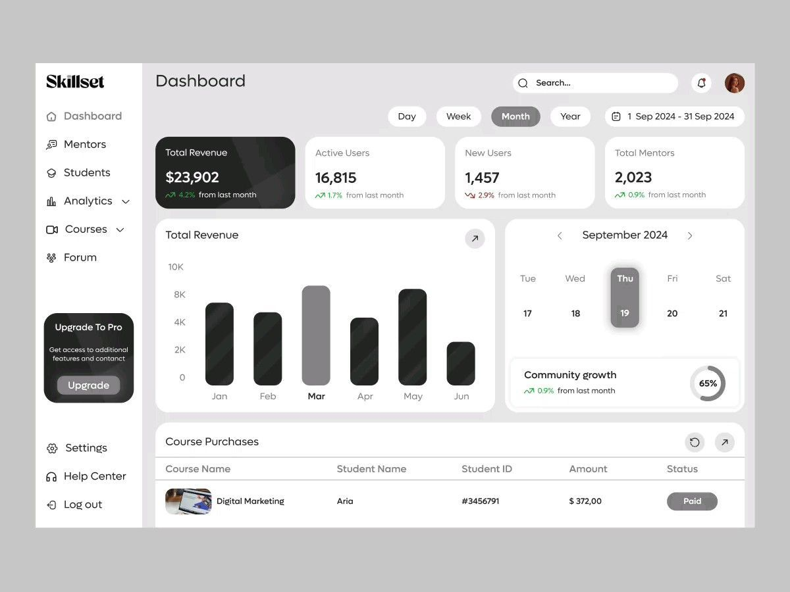
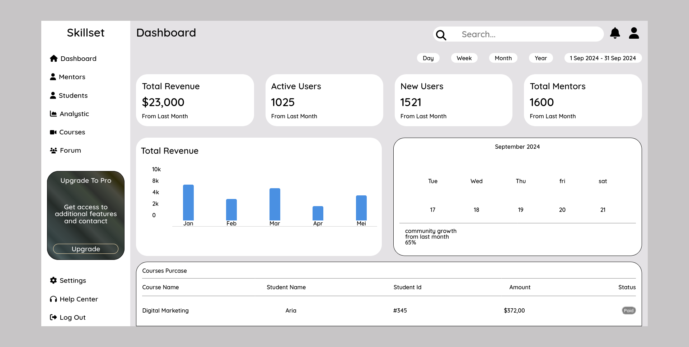

# Dashboard Page

A simple dashboard page built as an HTML and CSS practice project.

This repository contains a dashboard layout recreated from a design reference to improve my front-end fundamentals, including semantic HTML structure, Flexbox layout, and CSS styling.

## Preview

Reference design:

[reference source](https://id.pinterest.com/pin/1023935665295456950/)

Implementation:

## Built With
- HTML
- CSS
- Font Awesome (icons)

## Goals
- Practice building a dashboard layout (desktop view)
- Improve spacing, typography, and UI component styling
- Strengthen HTML and CSS fundamentals

## Notes
- This project is currently designed for desktop view only.
- Responsive support may be added later.
